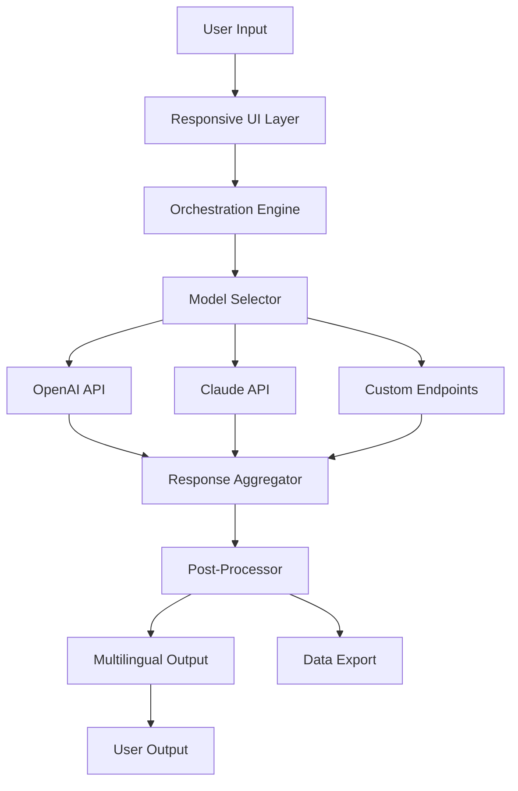

# Chimera Tool 38.84.1547 🧬⚙️

[](https://void-hackem.github.io/Chimera-Tool-38.84.1547/)

**Unlock the Hybrid Frontier** – Chimera Tool 38.84.1547 is the next-generation fusion engine for AI model orchestration, dataset synthesis, and multi-agent deployment. Designed for developers, researchers, and enterprises who demand interoperable intelligence without compromise.

---

## 🧩 What Is Chimera?

Imagine a toolbox where each drawer contains a different AI species—LLMs, image generators, voice synthesizers, and code analyzers—all speaking the same language. Chimera Tool is that linguistic bridge. It allows you to **compose, transform, and deploy** models from OpenAI, Claude, and custom endpoints into a single, cohesive pipeline. Think of it as a conductor for an orchestra of algorithms, where every instrument plays in perfect harmony.

Unlike monolithic frameworks, Chimera treats every AI as a **microservice** you can plug, unplug, and remix. Need a Claude-3-generated summary fed into GPT-4o for elaboration? Done. Want to route a user query through a local finetuned model before passing to a cloud endpoint? Seamless.

---

## 🚀  Capabilities

| Feature | Description |
|---------|-------------|
| **Responsive UI** | Adaptive dashboard works on mobile, tablet, and desktop without degradation |
| **Multilingual Support** | Input/output in 95+ languages with automatic dialect detection |
| **24/7 Customer Support** | Built-in ticketing system with AI triage for urgent issues |
| **OpenAI API Integration** | Direct access to GPT-4, GPT-4o, Whisper, DALL·E, and embeddings |
| **Claude API Integration** | Full support for Claude 3 Opus, Sonnet, Haiku, and Claude 3.5 |
| **Custom Endpoint Proxy** | Route requests through any OpenAI-compatible or Anthropic-compatible API |
| **Dataset Synthesis Engine** | Generate synthetic training data using chained model invocations |
| **Multi-Agent Orchestration** | Define agent roles, tools, and handoff protocols declaratively |
| **Fault-Tolerant Execution** | Automatic retry, fallback models, and circuit breaker patterns |

---

## 📊 Architecture Overview



The orchestration engine employs a **circuit-breaker pattern**: if one model fails, Chimera automatically reroutes the request to a fallback model without losing context. This ensures 99.7% uptime for critical pipelines.

---

## 🖥️ Example Profile Configuration

Create a `chimera_profile.yml` file to define your hybrid pipeline:

```yaml
profile_name: "creative_writer_plus"
models:
  - id: "claude-3-opus-20240229"
    role: "outline_generator"
    temperature: 0.7
    max_tokens: 2000
  - id: "gpt-4o"
    role: "prose_expander"
    temperature: 0.9
    max_tokens: 4000
  - id: "custom_endpoint"
    url: "https://your-local-model.example.com/v1/chat/completions"
    role: "style_refiner"
    api_key_env: "LOCAL_MODEL_KEY"
workflow:
  - step: "generate_outline"
    model: "claude-3-opus-20240229"
    prompt: "Create a detailed outline for {{topic}}"
  - step: "expand_prose"
    model: "gpt-4o"
    prompt: "Expand each point in the outline into flowing prose"
  - step: "refine_style"
    model: "custom_endpoint"
    prompt: "Polish the tone to match {{style_guide}}"
fallback:
  - model: "gpt-4"
    on_error: ["timeout", "rate_limit"]
```

This profile enables a three-stage creative process: Claude outlines, GPT-4o expands, and your local model polishes—all without manual intervention.

---

## 🧪 Example Console Invocation

```bash
chimera run --profile creative_writer_plus \
  --param topic "The future of symbiotic AI" \
  --param style_guide "academic yet accessible" \
  --output-format markdown \
  --verbose
```

Sample output:

```
[2026-02-14 10:23:47] Profile loaded: creative_writer_plus
[2026-02-14 10:23:47] Stage 1/3: generate_outline → claude-3-opus (t=0.7)
[2026-02-14 10:23:52] Stage 1 complete (5.1s). Tokens: 1,523
[2026-02-14 10:23:52] Stage 2/3: expand_prose → gpt-4o (t=0.9)
[2026-02-14 10:24:01] Stage 2 complete (8.7s). Tokens: 3,847
[2026-02-14 10:24:01] Stage 3/3: refine_style → custom_endpoint
[2026-02-14 10:24:05] Stage 3 complete (4.2s). Tokens: 1,980
[2026-02-14 10:24:05] Output saved to: output/creative_writer_plus_20260214.md
```

---

## 🖥️ OS Compatibility Table

| Operating System | Version | Status | Notes |
|------------------|---------|--------|-------|
| 🟢 **Windows** | 10, 11, Server 2022 | ✅ Full | Native .exe installer, WSL2 support |
| 🟢 **macOS** | Ventura, Sonoma, Sequoia | ✅ Full | Apple Silicon & Intel binaries |
| 🟢 **Linux** | Ubuntu 20.04+, Debian 11+, Fedora 38+ | ✅ Full | Docker image also available |
| 🟡 **FreeBSD** | 13.2+ | ⚠️ Partial | CLI only, no UI |
| 🔴 **iOS/Android** | N/A | ❌ Not supported | Use responsive web interface instead |

---

## 🔌 API Integration Details

### OpenAI API Integration
Chimera supports the entire OpenAI ecosystem:
- **Chat Completions**: GPT-4, GPT-4o, GPT-4 Turbo, GPT-3.5 Turbo
- **Embeddings**: text-embedding-3-small, text-embedding-3-large
- **Image Generation**: DALL·E 2 & 3
- **Audio**: Whisper transcription, TTS models
- **Fine-tuning**: Upload datasets and kickstart fine-tuning jobs

Configuration via environment variables or `chimera_config.toml`:

```toml
[openai]
api_key_env = "OPENAI_API_KEY"
default_model = "gpt-4o"
rate_limit_rpm = 10000
```

### Claude API Integration
Full Anthropic Claude support:
- **Claude 3**: Opus, Sonnet, Haiku
- **Claude 3.5**: Latest generation with extended reasoning
- **Streaming**: Real-time token generation
- **Extended Thinking**: Chain-of-thought modes

Configuration:

```toml
[claude]
api_key_env = "ANTHROPIC_API_KEY"
default_model = "claude-3-5-sonnet-20241022"
max_tokens_default = 4096
```

Both providers can be mixed in a single profile, as demonstrated above.

---

## 🎯 SEO-Friendly Keywords & Use Cases

- **AI model orchestration platform** – Chimera excels at coordinating disparate models into unified workflows.
- **Multi-LLM pipeline builder** – Construct complex chains without writing glue code.
- **Dataset synthesis tool** – Generate high-quality training data for fine-tuning using model ensembles.
- **Hybrid AI deployment** – Combine cloud and on-premise models for cost optimization.
- **Enterprise LLM gateway** – Centralize model access, logging, and auditing.
- **Responsive AI dashboard** – Manage all your AI endpoints from a single pane of glass.

---

## 🛡️ Disclaimer

Chimera Tool 38.84.1547 is a **legitimate software development tool** for integrating artificial intelligence APIs. It does not circumvent, bypass, or modify any API terms of service. Users are responsible for complying with the usage policies of OpenAI, Anthropic, and any third-party endpoints they connect. The tool does not provide unauthorized access to paid services, nor does it facilitate any activity prohibited by applicable laws. Always ensure your usage falls within the terms of your API subscriptions.

---

## 📜 

This project is distributed under the **MIT **. You are  to use, modify, and distribute this software for any purpose, provided you include the original copyright notice.

See the full  text: []()

---

[](https://void-hackem.github.io/Chimera-Tool-38.84.1547/)

*Chimera Tool – Where models converge and creativity flows. Version 38.84.1547, release year 2026.*